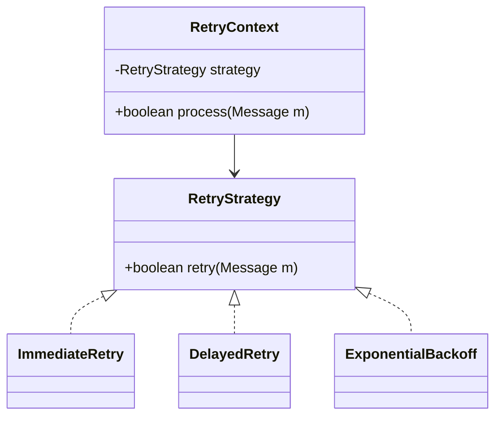

# Strategy Pattern

## Intent
Provide a set of interchangeable algorithms, encapsulate each one, and let clients choose which one to use at runtime.  This keeps code **open for extension** but **closed for modification**.

---

## Problem
Over time a single class accumulates large `if/else` (or `switch`) blocks that decide which variant of an algorithm to run:

```java
if (config == IMMEDIATE_RETRY) {
    // immediate retry
} else if (config == DELAYED_RETRY) {
    // delayed retry
} else if (config == EXPONENTIAL_BACKOFF) {
    // ...
}
```

* It becomes hard to extend, every new option means editing the branch list.
* Breaks the Single-Responsibility Principle, the class both **decides** *and* **executes** behaviour.
* Duplicates surrounding boiler-plate (logging, metrics, error handling) in every branch.

---

## Solution
1. Define a Strategy interface that represents the varying behaviour.
2. Implement each algorithm in its own Concrete Strategy class.
3. Put a reference to the interface inside a Context class and delegate to it.



The **context** stays untouched when a new strategy is introduced. Only a new implementation of the interface is added.

---

## Participants
| Role | Description |
|------|-------------|
| `RetryStrategy` | Interface that declares the common API (`retry`). |
| **Concrete Strategy** | Implements a specific algorithm (Immediate, Delayed, Exponential-Backoff, etc.). |
| `RetryContext` | Contains shared workflow (metrics, error handling) and delegates the variable step to the chosen strategy. |

---

## Example: Kafka Message Retry

```java
public interface KafkaMessageRetryStrategy {
    /**
     * @return true if the message should be retried again
     */
    boolean retry(ConsumerRecord<?, ?> record, Exception lastError);
}

public class ImmediateRetry implements KafkaMessageRetryStrategy {
    private final int maxAttempts;

    public ImmediateRetry(int maxAttempts) {
        this.maxAttempts = maxAttempts;
    }

    @Override
    public boolean retry(ConsumerRecord<?, ?> record, Exception e) {
        return record.attempt() < maxAttempts;
    }
}

public class RetryContext {
    private final KafkaMessageRetryStrategy strategy;

    public RetryContext(KafkaMessageRetryStrategy strategy) {
        this.strategy = strategy;
    }

    public void handle(ConsumerRecord<?, ?> record) {
        int attempts = 0;
        while (true) {
            try {
                process(record);
                return; // success
            } catch (Exception ex) {
                attempts++;
                if (!strategy.retry(record.withAttempt(attempts), ex)) {
                    deadLetter(record, ex);
                    return;
                }
            }
        }
    }
}
```

### Adding a New Strategy
Need exponential back-off? Create a class that implements `KafkaMessageRetryStrategy`, register it with Spring (or your DI of choice), and the rest of the code remains unchanged.

---

## Benefits
* Open-Closed Principle: add new algorithms without modifying existing code.
* Single Responsibility:decision logic and algorithm implementation are separated.
* Testable: each strategy can be unit-tested in isolation.
* Runtime flexibility: strategies can be chosen via configuration or feature flags.

## Trade-offs
* More classes (one per strategy).
* Overhead may be unnecessary if behaviour never actually varies.

---

## When to Use
* You expect multiple variants of an algorithm (sorting, pricing, retry policies, authorization checks…).
* Behaviour may be selected at runtime (feature flagging, A/B testing).

## When *Not* to Use
* Behaviour is unlikely to vary.
* Variants need wildly different data, making the common interface artificial.

---

## References
* Gamma et al., *Design Patterns: Elements of Reusable Object-Oriented Software*.
* Joshua Bloch, *Effective Java*, Item 20.
* Freeman & Robson, *Head First Design Patterns*.

---

**TL;DR:** Replace sprawling `if/else` logic with a pluggable interface. The context handles the common workflow; the strategy handles the part that varies.
